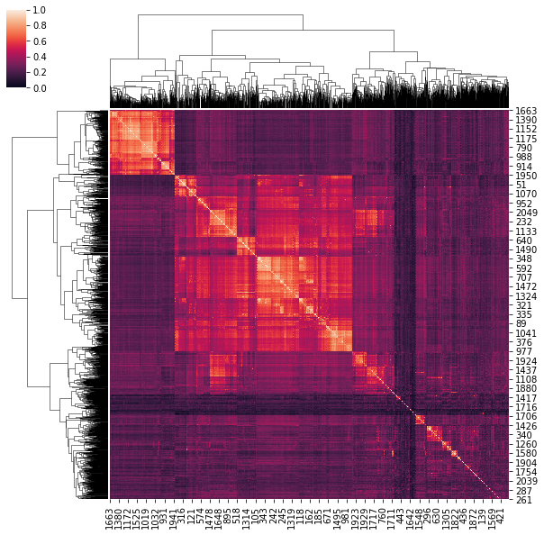
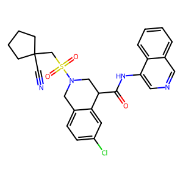
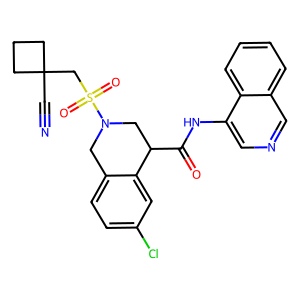
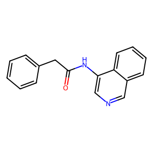
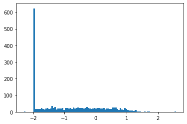
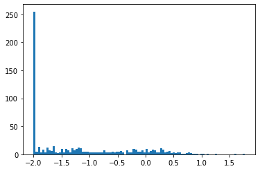
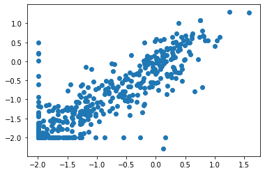

# Covid_moonshot_project

## Background
SARS-CoV-2 is a single stranded RNA coronavirus. The main protease, $M^{pro}$, also o known as “3-chymotrypsin-like protease". PDB ID 6LU7 contains the $M^{pro}$ with a inhibitor (N3). Molecules that bind specifically to $M^{pro}$ will likely avoid off-target binding to human proteases and thus $M^{pro}$ is an ideal drug target. 
Machine learning models that identify new compounds predicted to bind $M^{pro}$ will accelerate the discovery of new anti-COVID-19 treatments. 

## Binding affinity
Binding affinity can be quantified in different ways, including:  
● free energy change upon binding, ΔG (in kcal/mol)  
● dissociation constant, Kd, (in M, molar)  
● inhibition constant, Ki, (in M, molar)  
● half-maximal inhibitory concentration, IC50, (in M, molar)  

Note: IC50 values can't be compared unless they were measured at the same substrate concentration.

The IC50 is the half maximal inhibitory concentration and indicates the potency of a substance in inhibiting. The lower the IC50 value the less substance is needed to inhibit. To make a drug 

## Molecular descriptors 
Molecular features of the compounds are studied here by the Lipinski's rule of five. This is a rule of thumb to indicate the bioavailablity of the small molecule. According to the 'rule of five' a bioavailable molecule should not violate more than one of the following:  

● 5 or fewer hydrogen bond donors;  
● 10 or fewer hydrogen bond acceptors;  
● A molecular weight (MW) of less than 500 Daltons;  
● An octanol-water partition coefficient (log Po/w) of less than 5. Larger log Po/w means
more lipophilic (i.e., less water soluble).  

Here, RDkit (the rdkit.Chem.Descriptors package) is used to compute the molecular descriptors.  

```python
def calculate_descriptors(smile):
  molecule = Chem.MolFromSmiles(smile)
  if molecule:
    hbd, hba, mw, pow = [x(molecule) for x in [NumHDonors, NumHAcceptors, MolWt, MolLogP]]
    res = [hbd, hba, mw, pow]
  else:
    res = [None] * 4
  return res
```

The total dataset contained 2062 compounds. Of these compounds, 1539 met all four the Lipinski criteria. 1974 of the compounds met at least three of the criteria. 

So, filtering on meeting at least three of the Lipinski criteria's did give us more compounds.

## ECFP fingerprint
ECFP are topological fingerproints for molecular characterization. They are circular fingerprints. Qualities of these fingerprints are: they can be very rapidly calculated; they are not predefined and can represent an essentially infinite number of different molecular features (including stereochemical information); their features represent the presence of particular substructures, allowing easier interpretation of analysis results; and the ECFP algorithm can be tailored to generate different types of circular fingerprints, optimized for different uses.

The radius of the fingerprint determines how much 'local' information is captured
by the fingerprint, while the bit length specifies the total number of bits included in the
fingerprint.  The bigger the radius, the larger the substructures that are perceived by the algorithm. The fewer the number of bits used, the more likely different substructures will cause the same bit to be turned on. 

```python
#compute ECFP fingerprint with radius=2 and bit vector length=2048
from rdkit.Chem import AllChem
molecule = Chem.MolFromSmiles(smiles)
fp1 = AllChem.GetMorganFingerprintAsBitVect(molecule,2,nBits=1024)
```

The compounds are clustered based on the Tanimoto index:

```python
from rdkit import DataStructs
DataStructs.FingerprintSimilarity(fp1,fp2, metric=DataStructs.DiceSimilarity)
```

We clustered the similarity values using the seaborn.clustermap() function. 



Two molecules with the highest Tanimoto index are visualised below. 





### Murcko Scaffolds
The Marcko scaffolds represent core structures of bioactive compounds. Note that the scaffolds are generic and important structural features essential for pharmaceutical activity are not presented in these scaffolds. However, it is an interesting first analysis to cluster the core building blocks of the compounds in our dataset.

We found 19 scaffolds containing more than 10 compounds. The most occuring compound is shown below.



## Distribution of binding affinity values
The IC50 values in our dataset have the unit mM. We calculated the pIC50 values. 
The distribution of the binding affinity values (pIC50) show an overrepresentation of .. values. This means many compounds do not bind to our target. 

Distribtion of pIC50 values of fluorescence assay


Distribtion of pIC50 values of mass spectrometry assay



Of our ... samples. .. contain IC50 values of the fluorescence assay, .. contain IC50 values of the mass spectrometry assay and .. contain both values. We checked the correlation between the f and r to decide on which values we want to train our model.



We see a high correlation but also a couple of values that did not show correlation. Therefore we descided to start with only the fluorescence values. 


## Dataset
We splitted our dataset in 80% training and 20% test. We will use 5-fold crossvalidation if we use machine learning methods with hyperparameters. 

First we filtered out all IC50 values equal or bigger than 99% to make sure the data is equally distributed. 

We determined the 200 chemical descriptors available in RDkit. 

We splitted the data randomly and ran a linear regression model. Next, we splitted the data using the three clusters we observed in out clustermap. 
As input features we used the 200 molecular descriptors. 
